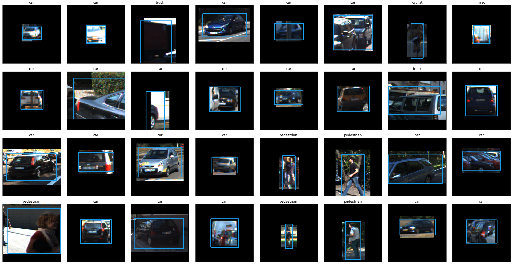

# torchvision-classifiers
This repository contains a variety of tests for training pytorch models with ResNet and VGG pretrained backbones for binary and mutliclass classification as well as 2D and 3D bounding box regression. Work on this repository is ongoing, so the repository will be cleaned up once it has reached a more permanent state. Some examples of bounding box regression are shown below. 

The network performs classification across 8 classes with around 95% accuracy, and performs bounding box regression at about 70% intersection-over-union overlap. It should be noted that a single regression head was trained for all 8 classes, whereas a model with a separate regression head for each class would be expected to make more nuanced and accurate prediction. Forward computation time for this network for a batch of 32 images on an NVIDIA GTX 1070 is 0.0033 seconds.

